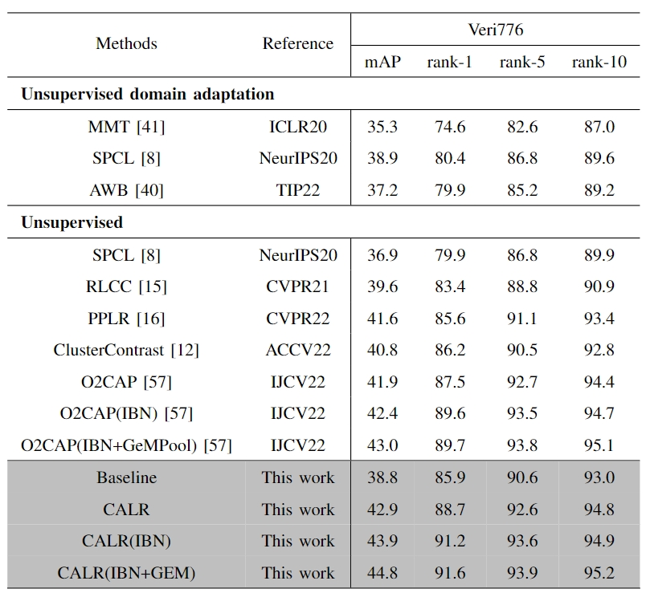

# Camera-aware Label Refinement for Unsupervised Person Re-Identification

The *official* repository for [Camera-aware Label Refinement for Unsupervised Person Re-Identification](https://arxiv.org/abs/2403.16450). We achieve state-of-the-art performances on purly unsupervised tasks for object re-ID.

**Our unified framework**


## Requirements

### Installation

```shell
git clone https://github.com/leeBooMla/CALR
cd CALR
python setup.py install
```

### Prepare Datasets

Download the person datasets Market-1501,MSMT17,DukeMTMC-reID and the vehicle datasets VeRi-776. Then put them under a foler such as '/xx/xx/dataset'
Then unzip them under the directory like

```
/xx/xx/dataset
├── market1501
│   └── Market-1501-v15.09.15
├── msmt17
│   └── MSMT17_V1
├── dukemtmcreid
│   └── DukeMTMC-reID
└── veri
    └── VeRi
```

### Prepare ImageNet Pre-trained Models for IBN-Net

When training with the backbone of [IBN-ResNet](https://arxiv.org/abs/1807.09441), you need to download the ImageNet-pretrained model from this [link](https://drive.google.com/drive/folders/1thS2B8UOSBi_cJX6zRy6YYRwz_nVFI_S) and save it under the path of `examples/pretrained/`.

ImageNet-pretrained models for **ResNet-50** will be automatically downloaded in the python script.

## Training

We utilize 4 GTX-2080TI GPUs for training.

+ The training have two stages, we first conduct intra-camera training to save the local_clusters. Or you could directly our local results in [Baidu Yun](https://pan.baidu.com/s/1JXOAlRDx7Bv-XGRI3clkkw?pwd=2qwm)(password:2qwm);

+ use `--iters 200` (default) for Market1501, and `--iters 400` for other datasets;

+ use `--width 128 --height 256` (default) for person datasets, and `--height 224 --width 224` for vehicle datasets;

+ use `-a resnet50` (default) for the backbone of ResNet-50, and `-a resnet_ibn50a` for the backbone of IBN-ResNet.

**examples:**
### inter-camera training ###
```shell
CUDA_VISIBLE_DEVICES=0,1,2,3 python intra_camera_training.py -b 256 -a resnet50 -d veri --iters 100 --epochs 20
```
### inter-camera training ###
```shell
CUDA_VISIBLE_DEVICES=0,1,2,3 python inter_camera_training.py -b 256 -a resnet50 -d veri --iters 400 --epochs 50
```

## Evaluation

We utilize 1 GTX-2080TI GPU for testing. **Note that**

To evaluate the model, run:
```shell
CUDA_VISIBLE_DEVICES=0 \
python test.py \
  -d $DATASET --resume $PATH
```

## Results





You can download the above models in the paper from [Baidu Yun](https://pan.baidu.com/s/1uDKJA7cLn39zTPiHAUOjfA?pwd=vc3h) (password: vc3h)


## Citation

If you find this code useful for your research, please cite our paper
```
@misc{li2024cameraaware,
      title={Camera-aware Label Refinement for Unsupervised Person Re-identification}, 
      author={Pengna Li and Kangyi Wu and Wenli Huang and Sanping Zhou and Jinjun Wang},
      year={2024},
      eprint={2403.16450},
      archivePrefix={arXiv},
      primaryClass={cs.CV}
}
```

# Acknowledgements

Thanks to Yixiao Ge for opening source of his excellent works  [SpCL](https://github.com/yxgeee/SpCL). 
